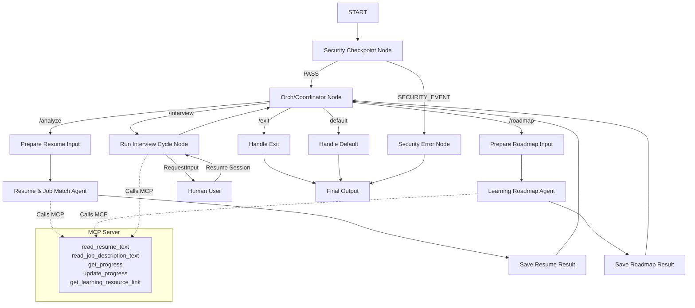
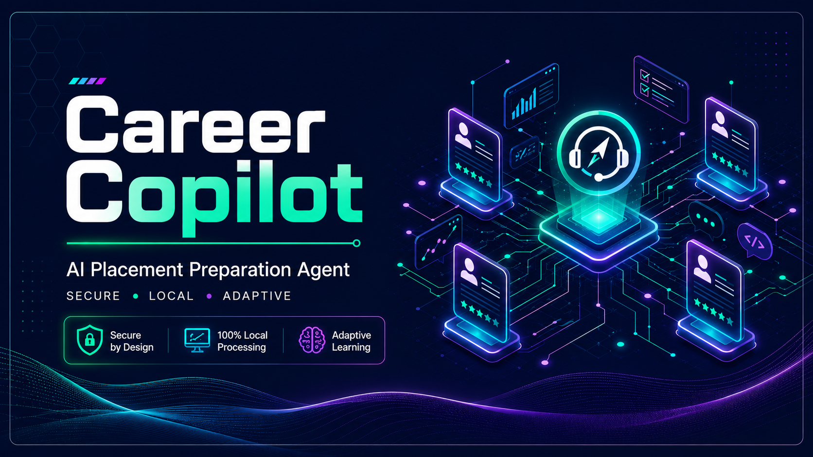
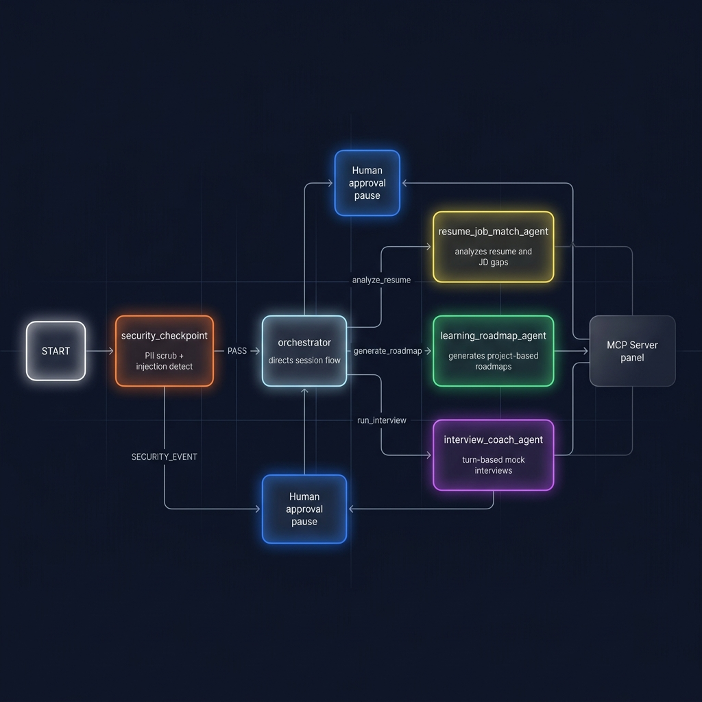
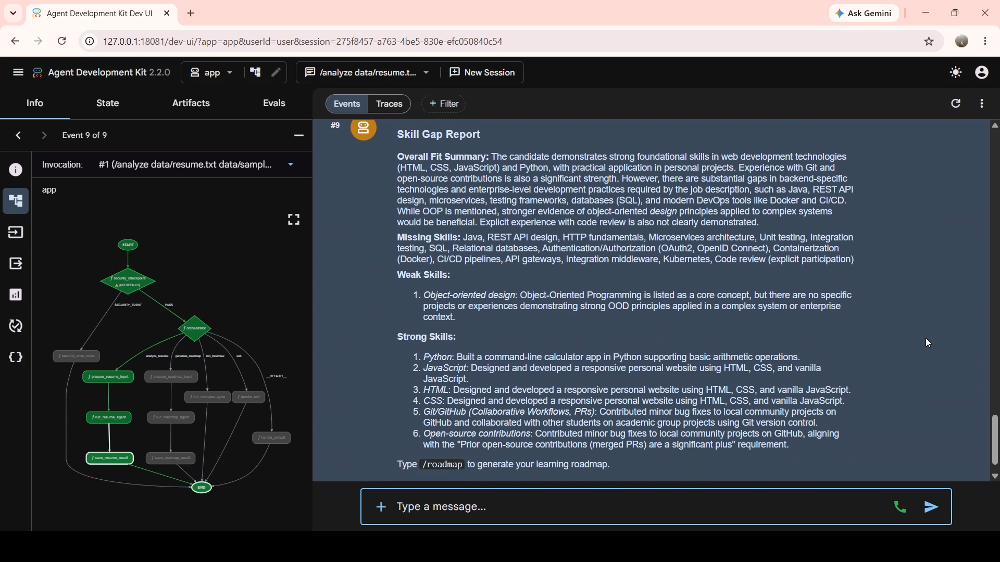

# Career Copilot — AI Placement Preparation Agent

Career Copilot is a secure multi-agent system built using the Google Agent Development Kit (ADK) that reads a student's resume, identifies skill gaps against a target job description, generates a personalized learning roadmap with concrete projects, and coaches them through mock interviews to track readiness.

## Prerequisites

- Python 3.11 or higher
- [uv](https://astral.sh/uv) - Python package manager
- Gemini API key from [Google AI Studio](https://aistudio.google.com/apikey)

## Quick Start

1. Clone the repository:
   ```bash
   git clone https://github.com/<your-username>/career-copilot.git
   cd career-copilot
   ```

2. Set up the environment variables:
   ```bash
   cp .env.example .env
   # Open .env and add your GOOGLE_API_KEY
   ```

3. Install dependencies:
   ```bash
   make install
   ```

4. Launch the local Playground UI:
   - **On macOS/Linux**:
     ```bash
     make playground
     ```
   - **On Windows (PowerShell)**:
     ```powershell
     uv run adk web app --host 127.0.0.1 --port 18081 --reload_agents
     ```
     *(Opens the interactive developer UI at http://localhost:18081)*

---

## Solution Architecture



---

## Rubric Highlights

- **Deployability**: Full Terraform IaC under `deployment/terraform/` — provisions Cloud Run service (`service.tf`), storage (`storage.tf`), IAM (`iam.tf`), telemetry (`telemetry.tf`), and enabled APIs (`apis.tf`), with environment-specific variables in `vars/env.tfvars`.
- **Agent Skills**: `app/skills/resource_recommendation/SKILL.md` defines the `resource_recommendation` skill, invoked via the deterministic `get_learning_resource_link` MCP tool during `/roadmap` generation — no LLM calls or network requests, zero hallucination risk.

---

## Security

Career Copilot runs a security checkpoint (`security_checkpoint` in `app/agent.py`) as the mandatory first node in the workflow, before any user input reaches an LLM agent:

- **PII Scrubbing**: Regex-based detection redacts emails and phone numbers from all user input and uploaded file content (resume/JD text) before it's passed to any agent, replacing them with `[REDACTED_EMAIL]` / `[REDACTED_PHONE]`.
- **Prompt Injection Detection**: Scans input for known injection patterns (e.g. "ignore previous instructions", "jailbreak", "override instructions") and blocks execution with a `SECURITY_EVENT` route if detected, rather than passing the input through.
- **Domain Relevancy Check**: Flags input longer than 100 characters that contains no software-engineering-related terms, as a lightweight guard against off-topic or abusive use of the pipeline.
- **Local-Only Data**: All file parsing and progress tracking happen on the student's local machine (`storage/progress.json`); no resume or interview data is sent to any external store beyond the direct Gemini API calls needed for analysis.
- **Audit Logging**: Every security check emits a structured JSON log entry (`pii_detected`, `injection_detected`, `domain_relevant`, `severity`) for traceability.

Unit tests for the PII scrubbing logic are in `tests/unit/test_pii_scrubbing.py`.

---

## How to Run

- **Playground (Interactive UI Mode)**:
  `make playground` (runs on `http://localhost:18081`)
- **FastAPI Server Mode (Production)**:
  `make run` (runs on `http://localhost:8000`)

---

## Sample Test Cases

### Test Case 1: Initial Gap Analysis
* **Input**: Send `/analyze` (or specify paths: `/analyze data/resume.txt data/sample_jd_wso2_backend_intern.txt`).
* **Expected**: The workflow executes the `security_checkpoint` (passes), goes to `orchestrator`, then routes to `resume_agent` via `prepare_resume_input`. The agent calls the MCP server to read `resume.txt` and `sample_jd_wso2_backend_intern.txt`, compares them, and returns a JSON GapReport containing missing skills (FastAPI, Docker, REST APIs, SQL), weak skills, and strong skills (Python, Git).
* **Check**: You will see a formatted **Skill Gap Report** printed in the Playground chat UI, ending with a suggestion to run `/roadmap`.

### Test Case 2: Personalized Roadmap Generation
* **Input**: Send `/roadmap`.
* **Expected**: The workflow routes to `roadmap_agent`. It takes the gaps identified in Test Case 1, reads the local progress store (empty initially), prioritizes the gaps (e.g., FastAPI first, then SQL, Docker), and outputs a sequenced roadmap with resource links and hands-on projects (like "Build a REST API using FastAPI and SQLite").
* **Check**: A detailed **Personalized Learning Roadmap** with prioritized tasks and suggested projects appears in the chat UI.

### Test Case 3: Turn-Based Mock Interview (HITL)
* **Input**: Send `/interview FastAPI`.
* **Expected**: The workflow routes to `run_interview_cycle`. The `interview_agent` is called to generate a technical question about FastAPI. The node yields a `RequestInput(interrupt_id="user_answer")` containing the question and pauses. When you type your answer and hit submit, the node resumes, evaluates your answer, logs the score (0-100) and feedback to the progress store, and displays the score.
* **Check**: The UI first prompts you with the question. Once you respond, it shows the **Mock Interview Evaluation** containing your score and detailed critique.

---

## Troubleshooting

1. **Error: `no agents found` or `extra arguments` when running playground**
   - *Cause*: Incorrect agent directory name or using wildcard `*` expansion on Windows.
   - *Fix*: Ensure you run the exact Windows PowerShell command: `uv run adk web app --host 127.0.0.1 --port 18081 --reload_agents` (where `app` is the actual folder).
2. **Error: `404 Model Not Found` when sending queries**
   - *Cause*: Gemini 1.5 models are retired and return 404.
   - *Fix*: Check your `.env` file and verify `GEMINI_MODEL` is set to `gemini-2.5-flash` or `gemini-2.5-flash-lite`.
3. **Changes to `agent.py` or tools are not showing up in Playground**
   - *Cause*: On Windows, hot-reload does not work reliably due to event loop watcher conflicts.
   - *Fix*: Stop the server using the stop process command (see below) and start a fresh server.

To force-stop any background processes on Windows (PowerShell):
```powershell
Get-Process -Id (Get-NetTCPConnection -LocalPort 18081, 8090 -ErrorAction SilentlyContinue).OwningProcess | Stop-Process -Force
```

## Assets

### Cover Page Banner


### Architecture Diagram


### Playground Demo

*Skill Gap Report output from the `/analyze` command, showing the live agent workflow graph alongside the structured response.*

---

## Limitations & Future Improvements

**Current limitations:**
- Prompt injection detection is keyword-based and will not catch paraphrased or semantically disguised injection attempts.
- The MCP file-reading tools (`read_resume_text`, `read_job_description_text`) do not restrict absolute file paths to a sandboxed directory — acceptable for local single-user use, but not suitable as-is for a multi-tenant deployment.
- Progress and interview history are stored in a single local JSON file (`storage/progress.json`), which does not support concurrent users or sessions.

**Planned improvements:**
- Replace keyword-based injection detection with a lightweight classifier for more robust coverage.
- Add path sandboxing to MCP file tools before any multi-user or cloud deployment.
- Migrate local JSON progress storage to a proper per-user database (e.g. SQLite or Firestore) for multi-user support.
- Expand the Agent Skills library beyond resource recommendation (e.g. a resume-formatting skill, a mock-interview-question-bank skill).

---

## Demo Script

The spoken demonstration script for the submission video can be found at [DEMO_SCRIPT.txt](DEMO_SCRIPT.txt).
