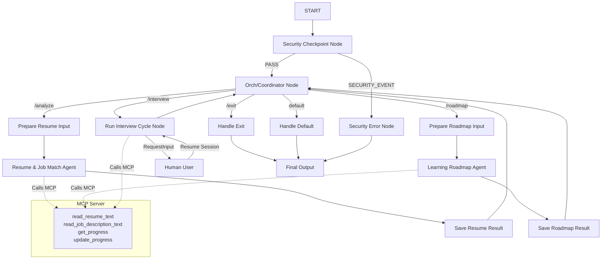

# Kaggle AI Agents Intensive: Capstone Submission Write-Up
## Career Copilot: AI Placement Preparation Agent

**Track:** Concierge Agents
**Builder:** Solo (Solo Developer)

---

### 1. Problem Statement
Preparing for internships and job placements is a major challenge for students. They struggle to find answers to critical questions:
- What skills are actually missing from my resume for a specific target role?
- How can I systematically close those gaps with hands-on projects rather than passive learning?
- Am I truly ready for technical interviews, and where specifically are my weak points?

Career Copilot solves this problem by offering a local, secure, and personalized concierge agent that acts as an end-to-end career strategist. By inputting their own resume and a target job description, students receive an instant skill-gap audit, a structured project-based roadmap, and interactive mock interview coaching that adapts to their progress over time.

---

### 2. Solution Architecture

---

### 3. Course Concepts Demonstrated

1. **ADK 2.0 Workflow & Graph Topology (`app/agent.py`)**
   - Implemented using the `Workflow` class from `google.adk.workflow`. We define nodes (functions and LLM agents) and coordinate them via conditional edges mapped to route-determining helper nodes (`orchestrator`, `security_checkpoint`).
   
2. **LlmAgent Sub-Agents (`app/agent.py`)**
   - Built three specialized `LlmAgent` instances:
     - `resume_job_match_agent`: Generates a structured JSON gap report.
     - `learning_roadmap_agent`: Translates gaps into project-based learning roadmaps.
     - `interview_coach_agent`: Runs turn-based mock interviews and evaluations.
     - Each uses standard `output_schema` validation to ensure structured, predictable API responses.

3. **AgentTool Delegation (`app/agent.py`)**
   - Used `AgentTool` to wrap specialized agents and make them available as tools for the workflow nodes. This allows parent orchestrator nodes to call specialist agents dynamically while maintaining execution context.

4. **Model Context Protocol (MCP) Server (`app/mcp_server.py`)**
   - Implemented an MCP server on the `stdio` transport using `FastMCP`. Exposes tools to read local files (`read_resume_text`, `read_job_description_text`) and manage state (`get_progress`, `update_progress`). The tools are connected to agents using the `McpToolset` class.

5. **Security Checkpoint Node (`app/agent.py`)**
   - Implemented `security_checkpoint` as the gateway node for the entire workflow. It performs PII scrubbing, detects prompt injections, enforces SWE-domain relevancy checks, and writes structured JSON logs for audit trails.

6. **Agents CLI Scaffolding (`app/` structure)**
   - Initialized and structured using `agents-cli scaffold create`, producing standard app configurations, environment variables (`.env`), and a pinned dependency workspace (`pyproject.toml`).

---

### 4. Security Design
- **PII Scrubbing**: Active regular expressions scan all user input for personal identifiers (such as emails and phone numbers) and replace them with `[REDACTED_EMAIL]` and `[REDACTED_PHONE]` before passing inputs to the LLM agents.
- **Prompt Injection Detection**: Scans user input for malicious keywords ("ignore previous instructions", "jailbreak", etc.) and routes the request to a `SECURITY_EVENT` handler, blocking further LLM execution.
- **SWE-Domain Relevancy Check**: An input validator verifies that any uploaded text contains tech-specific terms. If not, it raises a WARNING to prevent malicious or out-of-scope usage of model resources.
- **Local Sovereignty**: All processing (document reading, progress logging) is done locally on the student's machine. Data is never persisted in external cloud databases.

---

### 5. MCP Server Design
The local MCP server (`app/mcp_server.py`) runs as a background process and exposes the following tools:
1. `read_resume_text`: Parses PDF, DOCX, and TXT files using native libraries (`pypdf` and `python-docx`).
2. `read_job_description_text`: Parses job descriptions from a file or passes through raw pasted text.
3. `get_progress`: Reads the local progress store (`storage/progress.json`) to check what skills the student has already mastered.
4. `update_progress`: Saves scores, feedback, and completed skills back to the local progress store.

---

### 6. Human-in-the-Loop (HITL) Flow
The mock interview coach (`run_interview_cycle` in `app/agent.py`) leverages ADK's `RequestInput` mechanism.
- The workflow yields `RequestInput(interrupt_id="user_answer", message=question)` to pause execution.
- This suspends the state and prompts the user for their response.
- Once the user types their answer, the runner resumes the session and passes the user's answer back into the node for evaluation.

---

### 7. Demo Walkthrough
- **Phase 1: Gap Analysis (`/analyze`)**
  - Reads a student's resume (e.g., Python, Javascript) and a target job description (e.g., requiring FastAPI, Docker, SQL). Identifies skill gaps and outputs them in structured JSON.
- **Phase 2: Roadmap Generation (`/roadmap`)**
  - Generates a customized learning plan pointing the student to specific projects (e.g., "Build a REST API using FastAPI") to close the gaps.
- **Phase 3: Interview Coaching (`/interview FastAPI`)**
  - Generates a challenging FastAPI question. Once the student answers, the coach scores it (e.g., 85/100) and updates the local progress file. Subsequent roadmaps acknowledge this progress and prioritize other areas.

---

### 8. Impact / Value Statement
Career Copilot provides students with a targeted, self-contained, and completely secure mentor. By replacing generic advice with highly specific gap identification and project roadmaps, it transforms passive exam prep into active, hands-on portfolio building. This increases placement readiness while ensuring absolute privacy of personal academic and employment records.
